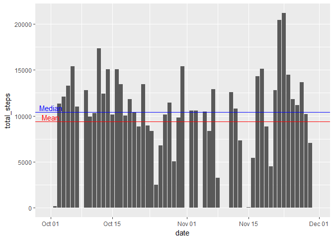
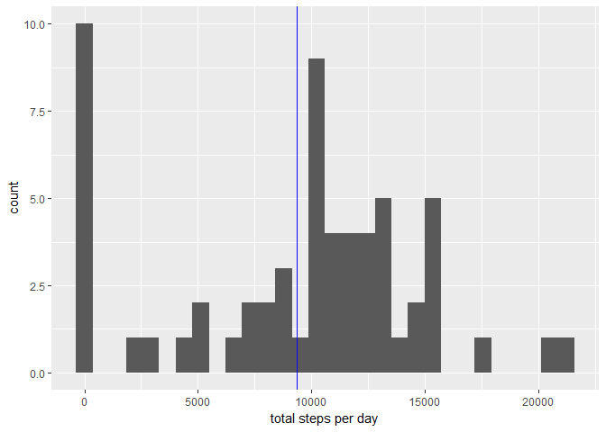
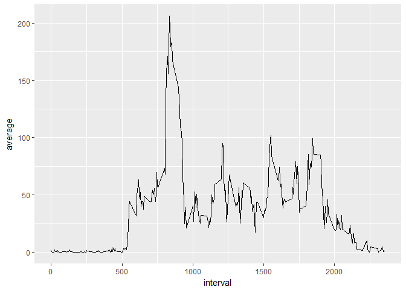
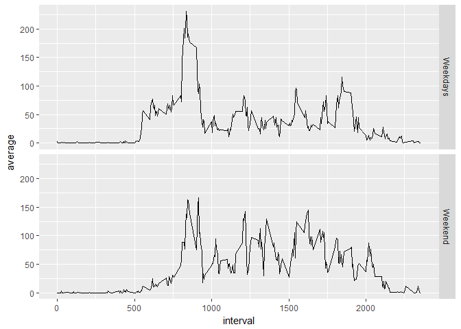

This is code generated by smvazirizade for the course reproducible
Reseasrch on coursera as a project

    ## 
    ## Attaching package: 'dplyr'

    ## The following objects are masked from 'package:stats':
    ## 
    ##     filter, lag

    ## The following objects are masked from 'package:base':
    ## 
    ##     intersect, setdiff, setequal, union

    ## 
    ## Attaching package: 'plotly'

    ## The following object is masked from 'package:ggplot2':
    ## 
    ##     last_plot

    ## The following object is masked from 'package:stats':
    ## 
    ##     filter

    ## The following object is masked from 'package:graphics':
    ## 
    ##     layout

1. Code for reading in the dataset and/or processing the data
=============================================================

Loading and preprocessing the data

    activity <- read.csv("data/activity.csv")
    activity$date <- as.Date(activity$date)
    head(activity)

    ##   steps       date interval
    ## 1    NA 2012-10-01        0
    ## 2    NA 2012-10-01        5
    ## 3    NA 2012-10-01       10
    ## 4    NA 2012-10-01       15
    ## 5    NA 2012-10-01       20
    ## 6    NA 2012-10-01       25

    str(activity)

    ## 'data.frame':    17568 obs. of  3 variables:
    ##  $ steps   : int  NA NA NA NA NA NA NA NA NA NA ...
    ##  $ date    : Date, format: "2012-10-01" "2012-10-01" ...
    ##  $ interval: int  0 5 10 15 20 25 30 35 40 45 ...

2. Histogram of the total number of steps taken each day
========================================================

First we draw the total number of steps per day as a barplot

    total_day <- activity %>% group_by(date) %>%summarise(total_steps=sum(steps,na.rm=TRUE),na=mean(is.na(steps)))
    head(total_day)

    ## # A tibble: 6 x 3
    ##   date       total_steps    na
    ##   <date>           <int> <dbl>
    ## 1 2012-10-01           0     1
    ## 2 2012-10-02         126     0
    ## 3 2012-10-03       11352     0
    ## 4 2012-10-04       12116     0
    ## 5 2012-10-05       13294     0
    ## 6 2012-10-06       15420     0

    ggplot(data=total_day, aes(x=date, y=total_steps)  )  +   geom_bar(stat="identity") + 
      geom_hline(yintercept = median(total_day$total_steps), color="blue") + 
      geom_hline(yintercept = mean(total_day$total_steps)  , color="red") +
      annotate("text", x = as.Date(min(total_day$date)), y = median(total_day$total_steps)+500 ,label = "Median", color="blue") +
      annotate("text", x = as.Date(min(total_day$date)), y = mean(total_day$total_steps)+500 ,label = "Mean", color="red")   

Then we draw the Histogram

     ggplot(data=total_day, aes(total_steps)  )  +  geom_histogram() + labs(x = "total steps per day") +
     geom_vline(xintercept = mean(total_day$total_steps), color="blue")  

    ## `stat_bin()` using `bins = 30`. Pick better value with `binwidth`.

3. Mean and median number of steps taken each day
=================================================

    mean_steps <- mean(total_day$total_steps,na.rm=TRUE)
    median_steps <- median(total_day$total_steps,na.rm=TRUE)

Mean and median of the total number of the steps per day are
9354.2295082 steps and 10395 steps, respectively.

4. Time series plot of the average number of steps taken
========================================================

     daily_patterns <- activity %>% group_by(interval) %>% summarise(average=mean(steps,na.rm=TRUE)) 
     ggplot(data=daily_patterns, aes(x=interval, y=average)) + geom_line(stat = "identity")

5. The 5-minute interval that, on average, contains the maximum number of steps
===============================================================================

    max_numb_steps_interval <- max(daily_patterns$average)

The maximum number of steps is 206.1698113.

6. Code to describe and show a strategy for imputing missing data
=================================================================

    na_number <- sum(is.na(activity$steps))
    without_NAs <- numeric(nrow(activity))
    for (i in 1:nrow(activity))
    {
            if (is.na(activity[i,"steps"])==TRUE)
                {
                        without_NAs[i]<-filter(daily_patterns,interval==activity[i,"interval"]) %>% select(average)
                } 
            else
                {
                        without_NAs[i]<-activity[i,"steps"]
                }
                        
    }
    activity_without_NAs<-mutate(activity,steps_no_NAs=without_NAs)
    head(activity_without_NAs)

    ##   steps       date interval steps_no_NAs
    ## 1    NA 2012-10-01        0     1.716981
    ## 2    NA 2012-10-01        5    0.3396226
    ## 3    NA 2012-10-01       10    0.1320755
    ## 4    NA 2012-10-01       15    0.1509434
    ## 5    NA 2012-10-01       20    0.0754717
    ## 6    NA 2012-10-01       25      2.09434

The whole number of the missing values are 2304.

7. Histogram of the total number of steps taken each day after missing values are imputed
=========================================================================================

total\_day\_noNAs &lt;- activity\_without\_NAs %&gt;%
mutate(steps\_no\_NAs=as.numeric(steps\_no\_NAs)) %&gt;% group\_by(date)
%&gt;% summarise(total\_steps=sum(steps\_no\_NAs))
ggplot(data=total\_day\_noNAs, aes(total\_steps) ) + geom\_histogram() +
labs(x = "total steps per day") + geom\_vline(xintercept =
mean(total\_day\_noNAs$total\_steps), color="blue")  
\`\`\`

8. Panel plot comparing the average number of steps taken per 5-minute interval across weekdays and weekends
============================================================================================================

Create a new factor variable in the dataset with two levels - "weekday"
and "weekend" indicating whether a given date is a weekday or weekend
day.

     activity_without_NAs <- mutate(activity_without_NAs, WeekDay= weekdays(date))  
     activity_without_NAs <- mutate(activity_without_NAs, WeekEnd= (activity_without_NAs$WeekDay=="Saturday" |  activity_without_NAs$WeekDay=="Sunday"))  
     total_day_noNAs_grouped <- activity_without_NAs  %>% group_by(interval,WeekEnd) %>% summarise(average=mean(as.numeric(steps_no_NAs)) )
     total_day_noNAs_grouped

    ## # A tibble: 576 x 3
    ## # Groups:   interval [?]
    ##    interval WeekEnd average
    ##       <int> <lgl>     <dbl>
    ##  1        0 FALSE   2.25   
    ##  2        0 TRUE    0.215  
    ##  3        5 FALSE   0.445  
    ##  4        5 TRUE    0.0425 
    ##  5       10 FALSE   0.173  
    ##  6       10 TRUE    0.0165 
    ##  7       15 FALSE   0.198  
    ##  8       15 TRUE    0.0189 
    ##  9       20 FALSE   0.0990 
    ## 10       20 TRUE    0.00943
    ## # ... with 566 more rows

     labels <- c('FALSE' = "Weekdays", 'TRUE' = "Weekend")
     ggplot(data=total_day_noNAs_grouped, aes(x=interval, y=average)) + geom_line(stat = "identity")+ facet_grid(WeekEnd~.~., labeller=labeller(WeekEnd = labels)) 

